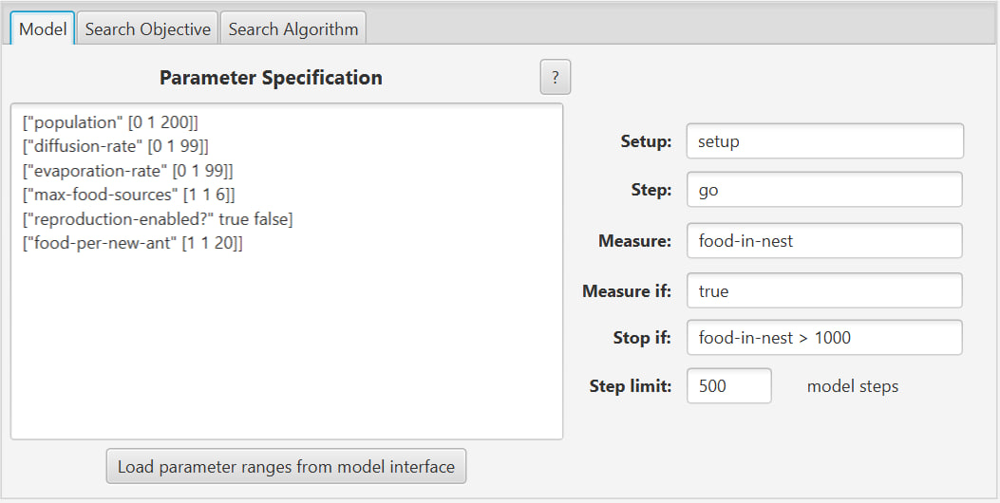
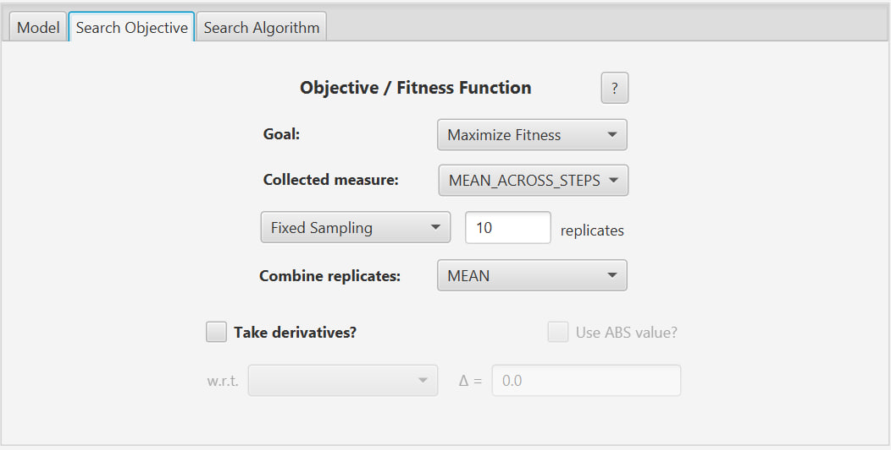
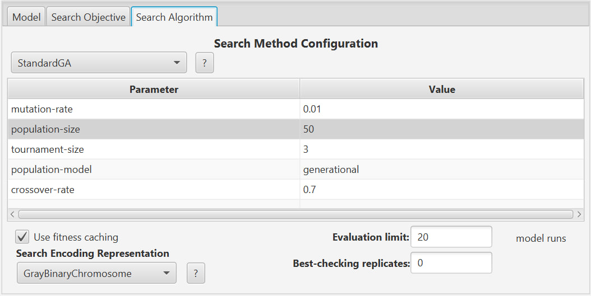
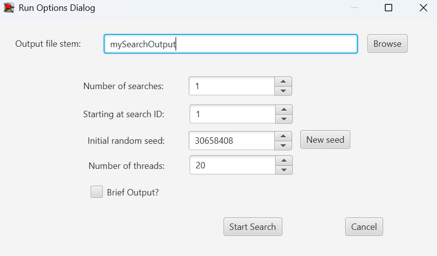
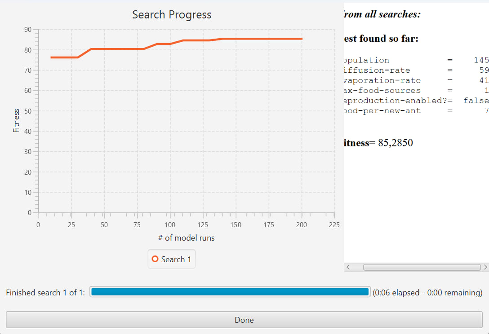
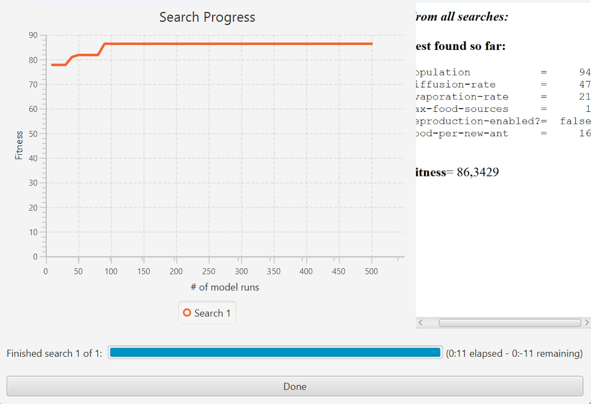

## Комп'ютерні системи імітаційного моделювання
## СПм-24-1, **Максимов Дмитро Максимович**
### Лабораторна робота №**3**. Використання засобів обчислювального інтелекту для оптимізації імітаційних моделей

 

### Варіант 10 - Модель переміщення мурах у пошуку їжі, модель у середовищі NetLogo:
[Ants](https://www.netlogoweb.org/launch#https://www.netlogoweb.org/assets/modelslib/Sample%20Models/Biology/Ants.nlogox)

Модель Ants описує поведінку мурашиної колонії, яка здійснює пошук їжі в середовищі та транспортує її до гнізда. Агенти (мурахи) пересуваються по середовищу, керуючись простими локальними правилами, використовуючи хімічні сліди для орієнтації. У процесі руху мурахи випадково блукають середовищем, доки не знайдуть джерело їжі. Знайшовши їжу, мураха повертається до гнізда, залишаючи на шляху хімічний слід (феромон). Інші мурахи можуть орієнтуватися на ці сліди, що приводить до формування стійких маршрутів між гніздом і джерелами їжі. Модель демонструє колективну поведінку, самоорганізацію та ефект посилення оптимальних шляхів у системі з великою кількістю простих агентів.

 

## Керуючі параметри
- **population** - визначає кількість агентів (мурах) у середовищі моделювання.
- **diffusion-rate** - визначає швидкість дифузії хімічного сліду між клітинками середовища.
- **evaporation-rate** - визначає швидкість випаровування (зникнення) хімічного сліду з часом.
- **max-food-sources** - визначає кількість джерел їжі, розміщених у середовищі.

## Показники роботи моделі
- **food-in-nest** - загальна кількість їжі, доставленої мурахами до гнізда за час симуляції.
- **population size** - поточна кількість мурах у середовищі (у разі ввімкненого розмноження).

У даній роботі основним показником ефективності обрано змінну **food-in-nest**.

## Налаштування середовища BehaviorSearch

### Обрана модель

C:\Program Files\NetLogo 6.3.0\models\ants3

Параметри та їх можливі діапазони були автоматично вилучені середовищем BehaviorSearch з інтерфейсу імітаційної моделі за допомогою кнопки **«Load parameters from model interface»**:

<pre>
["population" [0 1 200]
["diffusion-rate" [0 1 99]]
["evaporation-rate" [0 1 99]]
["max-food-sources" [1 1 6]]
["reproduction-enabled?" true false]
["food-per-new-ant" [1 1 20]]
</pre>
  
Діапазони значень параметрів були підібрані таким чином, щоб з одного боку охопити достатньо широкий простір пошуку, а з іншого - не надмірно збільшувати час симуляції:

<pre>
["population" [0 1 200]]
["diffusion-rate" [0 1 60]]
["evaporation-rate" [0 1 60]]
["max-food-sources" 1]
["reproduction-enabled?" false]
["food-per-new-ant" [1 1 20]]
</pre>

### Використовувана міра

Для функції пристосованості було обрано значення кількості їжі, доставленої до гнізда: food-in-nest

Цей показник безпосередньо характеризує ефективність роботи мурашиної колонії.

Значення показника враховувалося в середньому за весь період симуляції тривалістю **500 тактів**.
Параметр **Measure if** мав значення `true`, що означає облік значень на всіх тактах симуляції.
Процедури **Setup** та **Go** відповідали стандартним процедурам моделі NetLogo.
Параметр зупинки за умовою (**Stop if**) використовувався з умовою food-in-nest > 1000.

## Налаштування цільової функції (вкладка Search Objective)

Метою підбору параметрів імітаційної моделі є **максимізація кількості їжі, доставленої в гніздо**.

Для цього у параметрі **Goal** було обрано значення: Maximize Fitness

Оскільки значення показника змінюється протягом симуляції, для параметра **Collected measure** було встановлено: MEAN_ACROSS_STEPS

Для зменшення впливу випадковості кожна симуляція повторювалася **10 разів**, а кінцеве значення функції пристосованості обчислювалося як середнє арифметичне.

## Налаштування алгоритму пошуку (вкладка Search Algorithm)

У ході лабораторної роботи використовувалися два алгоритми:

- **RandomSearch (випадковий пошук)**;
- **StandardGA (простий генетичний алгоритм)**.

Для обох алгоритмів було задано:

- **Evaluation limit** - 200 (для RandomSearch) та 20 поколінь (для GA).
- **Search Space Encoding Representation** - GrayBinaryChromosome.
- **Use fitness caching** - увімкнено.

Для генетичного алгоритму додаткові параметри (ймовірність мутації, кросоверу, розмір популяції) використовувалися за замовчуванням, оскільки цього було достатньо для коректної роботи алгоритму.

## Результати використання BehaviorSearch

### Результати генетичного алгоритму

Результат пошуку параметрів імітаційної моделі, використовуючи випадковий пошук:

Результат пошуку параметрів імітаційної моделі, використовуючи генетичний алгоритм:

