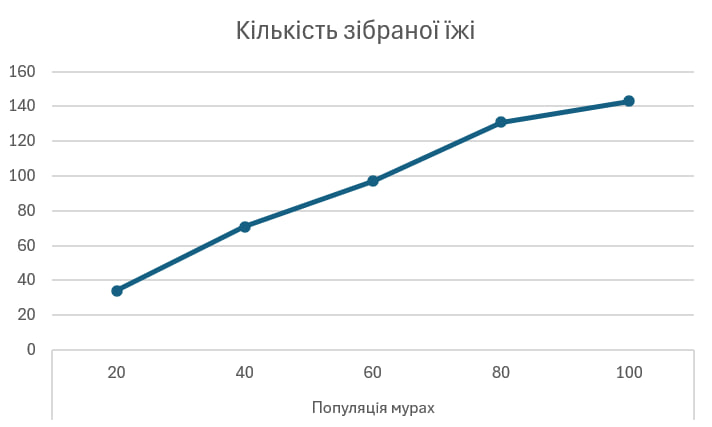
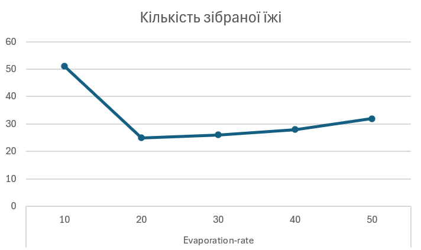
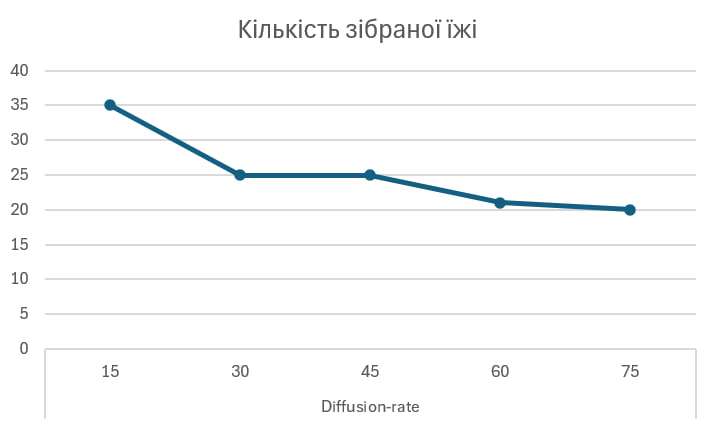

## Комп'ютерні системи імітаційного моделювання
## СПм-24-1, **Максимов Дмитро Максимович**
### Лабораторна робота №**1**. Опис імітаційних моделей та проведення обчислювальних експериментів

 

### Варіант 10 - Модель переміщення мурах у пошуку їжі, модель у середовищі NetLogo:
[Ants](https://www.netlogoweb.org/launch#https://www.netlogoweb.org/assets/modelslib/Sample%20Models/Biology/Ants.nlogox)

 

### Вербальний опис моделі:
Модель відтворює колонію мурах, які шукають їжу і при поверненні до гнізда залишають певний хімічний слід. Кожна мураха - агент з простим набором правил поведінки. Якщо мураха несе їжу - йде до гнізда, залишаючи за собою хімічний слід. Якщо не несе їжу - шукає її, орієнтуючись на концентрацію хімічного сліду у просторі.
Хімічний слід у свою чергу поширюється у просторі і поступово "випаровується". Таким чином, через взаємодію агентів виникає координована поведінка колонії.

### Керуючі параметри:
- **population** визначає кількість агентів у моделі, впливає на швидкість формування стежок та загальну продуктивність збору їжі.
- **diffusion-rate** визначає "поширення" хімічного сліду.
- **evaporation-rate** визначає швидкість випаровування хімічного сліду, вищий коефіцієнт призводить до швидшого випаровування.

### Внутрішні параметри:
- **chemical**. Кількість хімічної речовини у певному "патчі".
- **food**. Кількість їжі у просторі (0, 1 або 2 за оригінальною моделлю).
- **nest?**. Прапорець, чи є "патч" частиною гнізда.
- **nest-scent**. Скаляр, що визначає "запах" гнізда, чим ближче до гнізда - тим він більший.
- **food-source-number**. Ідентифікатор джерела їжі.
- **color**. Колір (червоний - нічого не несе, помаранчевий - несе їжу).
- **size**. Розмір мурах для візуалізації.

### Показники роботи системи:
- Час до вичерпання джерела їжі, вказує наскільки швидко колонія збирає ресурси.
- Кількість їжі у певний проміжок часу (наприклад, після 100 тактів).
- Стабільність стежки - наявність чіткої феромонової стежки до джерела.
- Кількість одночасно експлуатованих джерел - чи колонія працює над усіма джерелами паралельно або послідовно.

### Примітки:
- Модель показує класичний приклад виникнення колективної поведінки - підсилення позитивного зворотного зв'язку стежками з хімікатів й водночас ослаблення взаємозв'язку через дифузію або випаровування.
- Модель містить порогові значення чутливості мурах (реагують лише на рівні chemical між 0.05 і 2).

### Недоліки моделі:
- Обмеженість чутливості (верхній та нижній поріг), які можуть впливати на динаміку в неприродний спосіб.
- Для деяких досліджень модель може потребувати автоматизованого збору статистики та її зберігання, що наразі відсутнє.

 

## Обчислювальні експерименти
### 1. Вплив кількості мурах (population) на кількість зібраної їжі за фіксований час (500 тактів)
Досліджується зміна продуктивності колонії зі збільшенням population.

Експерименти проводяться при 20-100 мурах, з кроком 20, усього 5 запусків симуляції.
Інші керуючі параметри мають значення за замовчуванням:
- **diffusion-rate**: 40.0
- **evaporation-rate**: 40.0

<table>
<thead>
<tr><th>Популяція мурах</th><th>Кількість зібраної їжі</th></tr>
</thead>
<tbody>
<tr><td>20</td><td>34</td></tr>
<tr><td>40</td><td>71</td></tr>
<tr><td>60</td><td>97</td></tr>
<tr><td>80</td><td>131</td></tr>
<tr><td>100</td><td>143</td></tr>
</tbody>
</table>

Графік наочно показує, що на малих population продуктивність зростає майже лінійно з числом агентів, бо більше агентів швидше знаходять і транспортують їжу. При високих значеннях population спостерігається згладжування приросту - додавання мурах дає меншу віддачу, частково через тоншу передачу хімікату та "заважання".

### 2. Вплив evaporation-rate на швидкість збору їжі (200 тактів)
Досліджується як зміна швидкості випаровування хімікату впливає на здатність колонії швидко збирати їжу.

Експерименти проводяться при evaporation-rate = 10, з кроком 10, усього 5 запусків симуляції.
Інші керуючі параметри мають значення за замовчуванням:
- **population**: 40.0
- **diffusion-rate**: 20.0

<table>
<thead>
<tr><th>Evaporation-rate</th><th>Кількість зібраної їжі</th></tr>
</thead>
<tbody>
<tr><td>10</td><td>51</td></tr>
<tr><td>20</td><td>25</td></tr>
<tr><td>30</td><td>26</td></tr>
<tr><td>40</td><td>28</td></tr>
<tr><td>50</td><td>32</td></tr>
</tbody>
</table>

Графік наочно показує, що при зростанні коефіцієнта випаровування до 20-50 кількість зібраної їжі різко зменшується (25-32), оскільки слід швидко зникає, мурахи гірше координуються і частіше гублять маршрут.

### 3. Вплив diffusion-rate на швидкість збору їжі (200 тактів)
Досліджується як зміна дифузії хімікату впливає на здатність колонії швидко збирати їжу.

Експерименти проводяться при diffusion-rate = 15, з кроком 15, усього 5 запусків симуляції.
Інші керуючі параметри мають значення за замовчуванням:
- **population**: 40.0
- **evaporation-rate**: 30.0

<table>
<thead>
<tr><th>Diffusion-rate</th><th>Кількість зібраної їжі</th></tr>
</thead>
<tbody>
<tr><td>15</td><td>35</td></tr>
<tr><td>30</td><td>25</td></tr>
<tr><td>45</td><td>25</td></tr>
<tr><td>60</td><td>21</td></tr>
<tr><td>75</td><td>20</td></tr>
</tbody>
</table>

Із підвищенням diffusion-rate до 30-75 кількість зібраної їжі зменшується (від 25 до 20). Це відбувається тому, що при сильній дифузії хімікат надто сильно розмивається, через що сигнал стає нечітким і мурахи частіше втрачають правильний шлях.