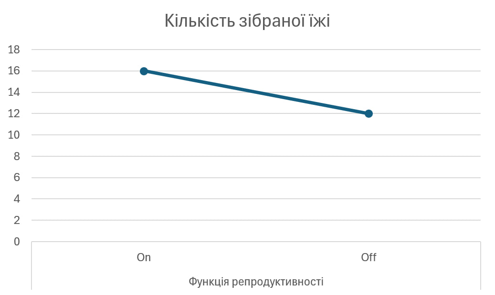

## Комп'ютерні системи імітаційного моделювання
## СПм-24-1, **Максимов Дмитро Максимович**
### Лабораторна робота №**2**. Редагування імітаційних моделей у середовищі NetLogo

 

### Варіант 10 - Модель переміщення мурах у пошуку їжі, модель у середовищі NetLogo:
[Ants](https://www.netlogoweb.org/launch#https://www.netlogoweb.org/assets/modelslib/Sample%20Models/Biology/Ants.nlogox)

Додати можливість вказувати кількість джерел їжі на полі. Ввести показник кількості зібраної їжі у гнізді, що відображається користувачеві. Відключаєма можливість появи нових мурах за умов наявності достатньої кількості їжі у гнізді. Відображати графік зміни кількості мурах.

 

### Зміни у логіці роботи моделі згідно варіанту
Нові глобальні змінні:
- food-in-nest - кількість одиниць їжі, накопичених у гнізді (ціла кількість).
- max-food-sources - кількість джерел їжі на полі (замість жорстко закодованих трьох джерел).
- reproduction-enabled? - перемикач, що дозволяє появу нових мурах, якщо у гнізді достатньо їжі.
- food-per-new-ant - порогова кількість їжі у гнізді, необхідна для створення однієї нової мурахи (ціле число).

Нові елементи інтерфейсу (Interface):
- Slider: max-food-sources (мінімум - 1, максимум - 6, початкове - 3).
- Monitor: food-in-nest.
- Switch: reproduction-enabled? (On/Off).
- Slider: food-per-new-ant (мінімум - 1, максимум - 20, початкове - 5).
- Plot: Ants population (ось X - ticks, Y - count turtles).

Нові функції:
- Генерація джерел їжі - setup-patches тепер використовує max-food-sources.
- Повернення їжі у гніздо - у процедурі return-to-nest при досягненні гнізда мураха, що несе їжу, зменшує локальний food на патчі і збільшує food-in-nest на 1, змінюється її колір на red та вона відправляється назад.
- Розмноження/створення нових мурах - у кінці кожного tick перевіряємо reproduction-enabled?. Якщо true та food-in-nest >= food-per-new-ant, то створюється одна нова мураха у гнізді і food-in-nest зменшується на food-per-new-ant. Якщо reproduction-enabled? = false - створення нових мурах вимкнено.
- Графік чисельності мурах - додано оновлення plot у кожному tick, записується поточна кількість мурах.

Додаткові зміни:
- Генерацію джерел їжі змінено зі статичної на динамічну, патчі з їжею відтепер генеруються у будь-якій точці простору.

 

## Обчислювальні експерименти
### 1. Вплив функції репродуктивності на кількість зібраної їжі за фіксований час (500 тактів)
Досліджується зміна продуктивності колонії зі зміною функції репродуктивності.

Експерименти проводяться при вимкненій та ввімкненій функції reproduction, усього 10 запусків симуляції (5 - увімкнено, 5 - вимкнено).
Інші керуючі параметри мають значення за замовчуванням:
- **population**: 5
- **diffusion-rate**: 40.0
- **evaporation-rate**: 40.0
- **max-food-sources**: 3
- **food-per-new-ant**: 3

У таблиці наведено усереднені результати з 10 симуляцій:
<table>
<thead>
<tr><th>Функція репродуктивності</th><th>Кількість зібраної їжі</th></tr>
</thead>
<tbody>
<tr><td>On</td><td>16</td></tr>
<tr><td>Off</td><td>12</td></tr>
</tbody>
</table>

Графік показує, що при активній функції репродуктивності мурахи змогли зібрати у середньому 16 одиниць їжі, тоді як без репродуктивності - лише 12 одиниць. Це свідчить, що збільшення чисельності колонії за рахунок народження нових мурах дозволяє швидше та ефективніше виконувати колективне завдання зі збору ресурсів.